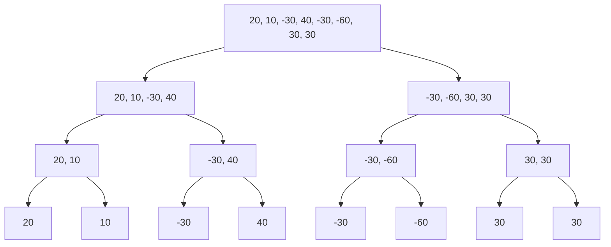

# 附录 II  算法分析与设计实例

!!! abstract
	本文内容包含大量实际算法分析语设计实例. 大部分内容标注了参考内容出处. 注意, 这部分内容并不是严格按照任何书籍顺序或者讲述内容进行的, 部分算法个人进行了优化调整, 部分实例拓展了其他几种算法.

## 最大子序列和[^1]

---

- 问题描述: 对于某一有限数列 $a_n=[a_1, a_2, a_3, \cdots]$, 我们取从第 $i$ 到第 $j$ 的项求和(包括 $a_i$ 和 $a_j$), 求该子数列和的最大值.

最简单的思路是完全穷举, 遍历所有选取方案. 原书图 2-5 算法 1 存在一个常见错误, 默认了总和最大值的结果不会小于 $0$. 但在部分 OJ 上这样写是不会通过的, 并且这样写也不够严格. 更通用的方式是改进原本的 `int maxSum = 0` 为 `int maxSum = s[0]`. 使用改进代码表述为

```cpp hl_lines="7"
int maxSubSeq(const vector<int> &s) {
	int length = s.size();
	if (length <= 0) {
		return 0;
	}

	int maxSum = s[0];
	for (int i = 0; i < length; i ++) {
		for (int j = i; j < length; j ++) {
			int thisSum = 0;
			for (int h = i; h <= j; h ++) {
				thisSum += s[h];
			}

			if (thisSum > maxSum) {
				maxSum = thisSum;
			}
		}
	}

	return maxSum;
}
```

我们设数列长度为 $n$, 则精确复杂度显然为 

$$
\begin{align*}
S&=\sum_{i=1}^{n}(1+2+3+\cdots +(n-(i-1)))\\
&=\frac{1}{2}\sum_{i=1}^{n}(i-(n+1))(i-(n+2))\\
&=\frac{1}{2}\sum_{i=1}^{n}(i^2-(2n+3)i+(n+1)(n+2))\\
&=\frac{1}{2}(\frac{1}{6}n(n+1)(2n+1)-\frac{1}{2}(2n+3)n(n+1)+n(n+1)(n+2))\\
&=\frac{1}{6}n(n+1)(n+2)=\frac{1}{6}n^3+\frac{1}{2}n^2+\frac{1}{3}n
\end{align*}
$$

当然, 我们可以直接简单设最坏情况作为复杂度. 也就是三层嵌套循环, 时间复杂度为 $O(N^3)$

这一时间复杂度显然可以进一步减小. 最显然的一点是, 在保留前一层 `for` 循环计算方式的前提下, 观察后两轮, 第三轮 `for` 循环完全没有必要. 假设已确定 $a_i$ 的位置, 而后从第 $i$ 开始向后计数到最后一项, 则从第 $i$ 项到第 $j$ 项的区间和可以加入到第 $i$ 项到第 $j+1$ 项的区间和. 换言之, 通过 $S_{[i, j+1]}=S_{[i, j]}+a_{j+1}$ 利用好上次计算的结果即可, 不需要重复计算. 使用代码表述为

```cpp
int maxSubSeq(const vector<int> &lst) {
    int length = lst.size();

    if (length <= 0) {
        return 0;
    }

    int maxSum = lst[0];
    for (int i = 0; i < length; i ++) {
        int nowSum = 0;
        for (int j = i; j < length; j ++) {
            nowSum += lst[j];

            if (nowSum > maxSum)
                maxSum = nowSum;
        }
    }

    return maxSum;
}
```

这一简单的优化思路将原本 $O(N^3)$ 的时间复杂度减少到了 $O(N^2)$. 但是, 这样是最完美的方式吗?

显然不是. 优化这一算法最简单的思路仍然是, 检查是否出现了重复计算的情况. 为了方便表述, 我们首先将上面的算法代码进行等价替换

```cpp
int maxSubSeq(const vector<int> &lst) {
    int length = lst.size();

    if (length <= 0) {
        return 0;
    }

    int maxSum = lst[0];
    for (int i = 0; i < length; i ++) {
        int nowSum = 0;
        for (int j = 0; j <= i; j ++) {
            nowSum += lst[j];

            if (nowSum > maxSum)
                maxSum = nowSum;
        }
    }

    return maxSum;
}
```

现在暂时抛开算法的具体实现, 我们考虑, 假设目前已经确定了 $[1,m-1]$ 上的最大子数列之和, 那么 $[1, m]$ 的最大子数列之和 $S_{[1, m]}$ 有且仅有两种情况

- 包括了第 $m$ 项, 也就是必须包括第 $m$ 项的 $[1, m]$ 上的最大子数列之和 $S_m$. 这一 $S_m$ 要么就是只包括 $a_m$ 本身, 要么就是 $a_m$ 加上前面从 $[1,m-1]$ 的包括 $a_{m-1}$ 最大子序列之和, 即 $a_m+S_{m-1}$. 这一点取决于二者之间大小关系.
- 不包括第 $m$ 项, 也就是已有的 $[1,m-1]$ 上的最大子数列之和 $S_{[1, m-1]}$.

这一完备的包含所有情况的事实将持续到整个数列完成遍历. 因此, 该处理方式具有可行性. 下面再确定二者的递推式. 根据上面的分析, 对于前者, 显然有 $S_m=\max(0, S_{m-1})+a_m$; 对于后者, 也显然有 $S_{[1, m]}=\max(S_m, S_{[1, m-1]})$.

这就是大名鼎鼎的 [卡丹算法](https://zh.wikipedia.org/wiki/%E6%9C%80%E5%A4%A7%E5%AD%90%E6%95%B0%E5%88%97%E9%97%AE%E9%A2%98). 我们用程序实现为

```cpp
int maxSubSeq(const vector<int> &lst) {
    int length = lst.size();

    if (length <= 0) {
        return -1;
    }

    int maxSeqSum = lst[0], endSeqSum = lst[0];

    for (int i = 1; i < length; i ++) {
        endSeqSum = max(0, endSeqSum) + lst[i];
        maxSeqSum = max(endSeqSum, maxSeqSum);
    }

    return maxSeqSum;
}
```

显然, 我们成功的将算法复杂度改善到了 $O(N)$. 上面这一线性时间复杂度的算法基本就是最优算法了. 但这显然不是最为通用的一种方法. 或者说, 这算是本问题的一个特解. 有没有什么更加一般的方式呢?

答案是当然. 虽然接下来讲解的方法时间复杂度不如上面的优秀, 但代表了一种普遍的算法思想. 这便是, **分治法**. 所谓分治, 即分而治之. 下面以最简单的二分法为例解决.

首先确定一般递归情况, 设数列 $a_{[1, n]}$, 我们以 $\left \lfloor \frac{n}{2} \right \rfloor$ 为界分为 $a_{[1, \left \lfloor \frac{n}{2} \right \rfloor]}$ 和 $a_{[\left \lfloor \frac{n}{2} \right \rfloor + 1, n]}$ 两部分, 则最子数列之和要么在 $a_{[1, \left \lfloor \frac{n}{2} \right \rfloor]}$, 要么在 $a_{[\left \lfloor \frac{n}{2} \right \rfloor + 1, n]}$, 要么在 $\left \lfloor \frac{n}{2} \right \rfloor$ 两边(跨过 $a_{[1, \left \lfloor \frac{n}{2} \right \rfloor]}$ 和 $a_{[\left \lfloor \frac{n}{2} \right \rfloor + 1, n]}$ 这两数列). 以此不断递归, 直到遇到 $\left \lfloor \frac{n}{2} \right \rfloor=0$ 的情况, 也就 $n=1$ 的情况(默认不为空数列). 为了方便说明, 我们以具体数列为例. 假设 $a_n=[20, 10, -30, 40, -30, -60, 30, 30]$, 则其可不断二分为:



我们设最高层为 $4$, 最底层为 $1$, 因此首先对 $1$ 层处理. 显然 $1$ 层各自的最大子序列和就是其本身. 接下来看 $2$ 层, 如果视作二元组 $(20, 10)$, 则值只可能为 $20$, $10$, 以及跨过二者的值. 唯一跨过的方式就是同时选择 $20$, $10$ 两项. 确定之后进一步向上到 $3$ 层, 则变为四元组 $(20, 10, -30, 40)$, 因此有且仅有两边最大值之一或者跨过中间项的值. 也就是说, 必须保证存在 $10$, $-30$, 再加上需要保证连续性, 因此只需要进行一次简单的两侧遍历: 首先对于左侧子数列, 必须包括 $10$, 以 $10$ 为基础向左遍历, 确定左侧过边界点最大值; 接下来对于右侧子数列, 必须包括 $-30$, 以 $-30$ 为基础向右遍历, 确定右侧过边界点最大值. 换言之, 过中间点的最大子数列和的值就是左侧过中间左边界点的最大子数列之和加上右侧过中间右边界点的最大子数列之和的和. 因为从边界点出发, 单轮每一层时间复杂度有且仅有 $O(N)$. 而我们总共需要计算 $\log N$ 次. 进一步推广, 考虑其他(奇数长度)情况, 使用二分展开到最后最终得到的最下面单个分支深度只可能减少, 也就是说将 $\log N$ 向上估计即可, 时间复杂度总计仍然为 $O(N\log N$).

利用上面的思路即可完成分治法版本的最大子序列和算法

```cpp
int maxSubSeq(const vector<int> &lst, const int &beg, const int &end) {
    /* 全部为闭区间, 包括 beg 和 end */
    /* 结束条件 */
    if (end == beg) {
        return lst[beg];
    }

    int beg_max = maxSubSeq(lst, beg, (beg + end)/2);
    int end_max = maxSubSeq(lst, (beg + end)/2 + 1, end);

    int lef_max = lst[(beg + end)/2], lef_sum = 0;
    for (int i = (beg + end)/2; i >= beg; i --) {
        lef_sum += lst[i];
        if (lef_sum > lef_max) {
            lef_max = lef_sum;
        }
    }

    int rig_max = lst[(beg + end)/2 + 1], rig_sum = 0;
    for (int i = (beg + end)/2 + 1; i <= end; i ++) {
        rig_sum += lst[i];
        if (rig_sum > rig_max) {
            rig_max = rig_sum;
        }
    }

    return max(lef_max + rig_max, max(beg_max, end_max));
}

int solve(const vector<int> &lst) { return maxSubSeq(lst, 0, lst.size() - 1); }
```

## 二分查找[^2]

---

- 问题描述: 对于一个已排序的给定数列 $a_n$ 和确定值 $X$, 满足 $a_{n-1}<a_{n}$, 寻找其中下标为 $i$ 的项 $a_i$, 使得 $a_i=X$.

二分查找原理很简单, 目标值 $X$ 只可能出现在三个位置上:

- 区间 $[1, \left \lfloor \frac{n+1}{2} \right \rfloor -1]$ 上
- 点 $\left \lfloor \frac{n+1}{2} \right \rfloor$ 处
- 区间 $[\left \lfloor \frac{n+1}{2} \right \rfloor +1, n]$ 上

并且对于数列的子数列($n \ge 3$)也满足这一点. 因此, 我们使用程序语言描述为

```cpp
int find_ele(const vector<int> &lst, const int &num) {
    /* 全部为闭区间 */
    int left = 0, right = lst.size() - 1;
    /* 注意关注边缘情况 */
    while (right >= left) {
        int mid = (left + right) / 2;
        if (lst[mid] == num) return mid;
        if (lst[mid] > num) right = mid - 1;
        else left = mid + 1;
    }
    return -1;
}
```

在 $n=2$ 和 $n=1$ 时带入运算, 检查确定极端情况下同样正确. 同时, 显然, 该算法的时间复杂度为 $O(log N)$.

## 辗转相除法(GCD)[^3]

---

- 问题描述: 求两个数的最大公约数.

首先证明这一事实: $\gcd(a, b) = \gcd(a,b\ mod\ a)(b > a)$:

显然, 设 $\gcd(a, b)=k$, 则一定有 $a=ka_s$, $b=kb_s$, 同时又因为 $b > a$ 有 $b=ca+d$, 因此 $kb_s=cka_s + d$, 因此 $d=k(b_s-ca_s)$, 因此 $d$(也就是 $b\ mod\ a$)一定有公因数 $k$.  另一面, 对于 $b_s-ca_s$ 和 $a_s$, 假设二者存在公因数 $p$, 则 $a_s=pa_t$, 且 $b_s-ca_s=pb_t-pca_t$. 换言之, $a=kpa_t$, $b=kpb_t$, 违背了 $k$ 为最大公因数的假设. 因此, $\gcd(a, b) = \gcd(a,b\ mod\ a)(b > a)$.

$GCD$ 的程序实现为

```cpp
int gcd(unsigned int a, unsigned int b) {
	int min_num = a > b ? b : a;
	int max_num = a > b ? a : b;
	while (min_num > 0) {
		int tmp = min_num;
		min_num = max_num % min_num;
		max_num = min_num;
	}
	return max_num;
}
```

这一程序的复杂度精确分析相当困难. 不过可以很容易得到, 满足 $b>a$ 的前提下必定有 $b\ mod\ a<\frac{b}{2}$. 假设 $b\ mod\ a \ge \frac{b}{2}$, 那么有: $b-ka\ge\frac{b}{2}$. 换言之,  $b\ge 2ka$, 必须有 $k=ak$, 与假设矛盾. 因此, 满足 $b>a$ 的前提下必定有 $b\ mod\ a<\frac{b}{2}$.

进一步, 算法至少每两轮可以减少二分之一的量, 也就是说时间复杂度至少为 $O(2\log N)$, 即 $O(\log N)$.

## 中缀表达式到后缀表达式转换算法[^4]

---

!!! note
	注意下面对于算法的证明严格意义上只能作为说明存在.

### 算法描述

对于输入的中缀表达式进行从左到右的扫描读取, 维护**符号栈**和**输出序列**. 我们规定

- 读到操作数时: 将操作数追加到输出序列
- 读到运算符时: 我们将符号栈的栈顶元素与读到的运算符 $o$ 优先级进行比较. 当栈顶元素相比于 $o$ 优先级更高或者相同时, 弹出栈顶元素并追加到输出序列, 并继续将更新后的栈顶元素与  的优先级进行比较, 直到这一情况结束, 而后将 $o$ 推入栈; 当栈顶元素优先级相比于 $o$ 更低时, 直接将 $o$ 推入栈
- 读到左括号时: 将左括号推入栈
- 读到右括号时: 将栈顶元素不断弹出追加到输出序列中, 直到读到左括号, 而后将左括号弹出(注意右括号没有被推入栈)
- 读取完成栈剩余符号时: 将栈顶元素全部弹出并依次追加到输出序列

### 引理

- 左操作数完备闭合

根据表达式从左到右的顺序, 显然, 对栈中自底向上所有运算符或者括号, 左侧的子后缀表达式一定已经完成输出全部位于**输出序列**; 右侧的子后缀表达式一定尚未输出或者部分输出. 为了方便描述, 我们称左侧的子后缀表达式为**左操作数**, 右侧的子后缀表达式为**右操作数**.

 - 右操作数完备闭合

当运算符 $o$ 弹出时, 运算符 $o$ 的右操作数必定恰好完备闭合. 对于**必定**, 是因为后缀表达式中任意运算符 $o$ 只能作用于其左侧的数. 对于**恰好**, 这一点是显然的(否则 $o$ 的右操作数就不是中缀表达式本来的右侧部分)

- 完备闭合描述

结合前面两点, 我们可以确定

- 运算符 $o$ 入栈 $\Longleftrightarrow$ $o$ 左操作数完备闭合
- 运算符 $o$ 出栈 $\Longleftrightarrow$ $o$ 右操作数完备闭合, 也就是子后缀表达式完备闭合

对于括号 $($ 与 $)$, 其闭合原理是显然的.

### 归纳证明

我们只需要考虑栈顶元素 $o$ 何时弹出. 每当读到相较于 $o$ 优先级更低的新运算符 $p$ 时, 因为 $o$ 已入栈, 其左操作数已完备, 只需要考虑右操作数是否完备. 显然, 读到优先级更低的运算符 $p$, 意味着右操作数边界已确定(如 $2\times3+4$ 中读到了 $+$ 时 $2\times3$ 已经是一个独立完备的子表达式), 因此弹出 $p$ 并追加到输出序列.

另外, 当中缀表达式读取完成后, 栈中剩余操作符应当依次弹出并追加到输出序列. 从完整性看, 如果不将运算符全部弹出, 那么无法还原为中缀表达式(或者说无法构建运算树); 从正确性看, 我们可以使用一个等价占位符 $+0$ 追加到中缀表达式, 以回归到上一段我们讨论的情况. 最后栈内残留 $+$, 表达式残留 $0$, 而最终后缀表达式一定形如 $A_s,0,+=A_s$, 同样完成归纳.

括号视作子栈与子输出序列即可.

时间复杂度显然为 $O(N)$, 并且实际上只需要一轮遍历.

### 程序实现(基于语法解析与后缀表达式的计算器)

程序实现较为繁琐(用 AI 写吧), 具体参见 [github 仓库](https://github.com/HollowDobt/algorithm/blob/main/stack/culculator.cpp).

[^1]:
	*Data Structures and Algorithm Analysis in C, Second Edition 2. 4. 3* P23

[^2]:
	*Data Structures and Algorithm Analysis in C, Second Edition 2. 4. 4* P28

[^3]:
	*Data Structures and Algorithm Analysis in C, Second Edition 2. 4. 4*  P30

[^4]: 
	*Data Structures and Algorithm Analysis in C, Second Edition 3. 3. 3* P73