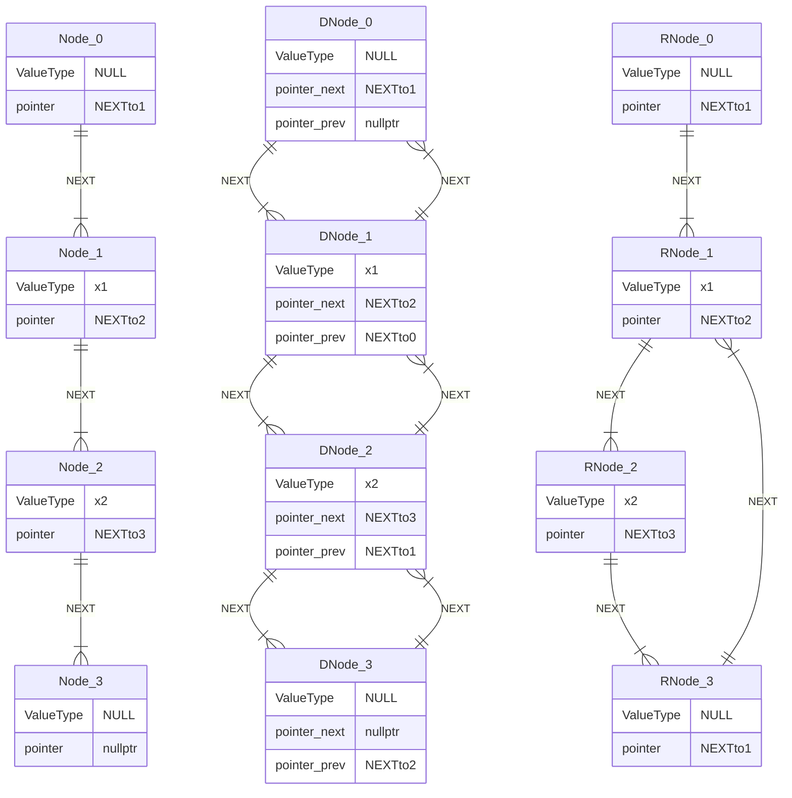
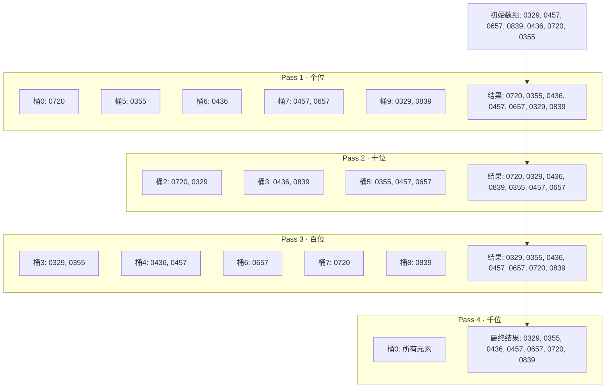
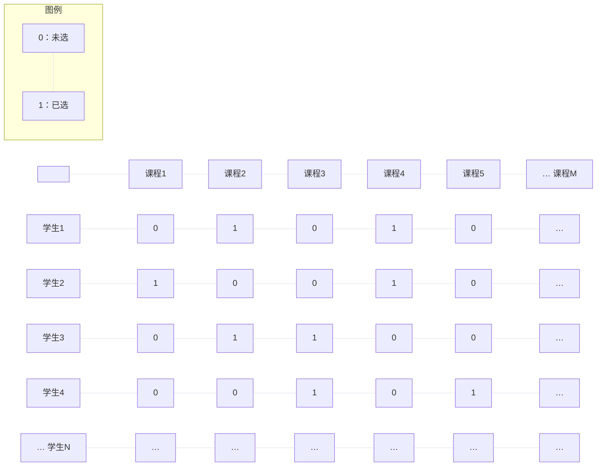
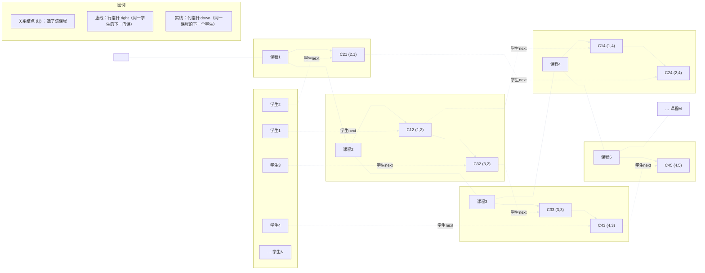
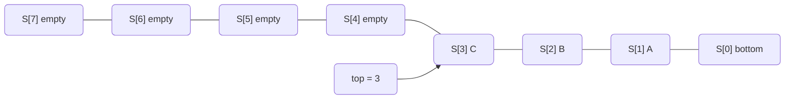
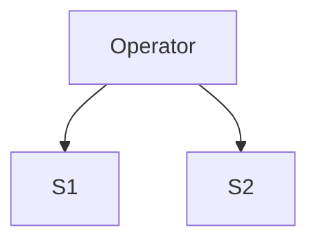
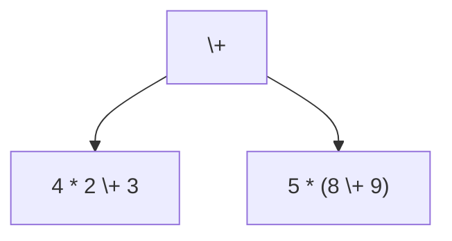
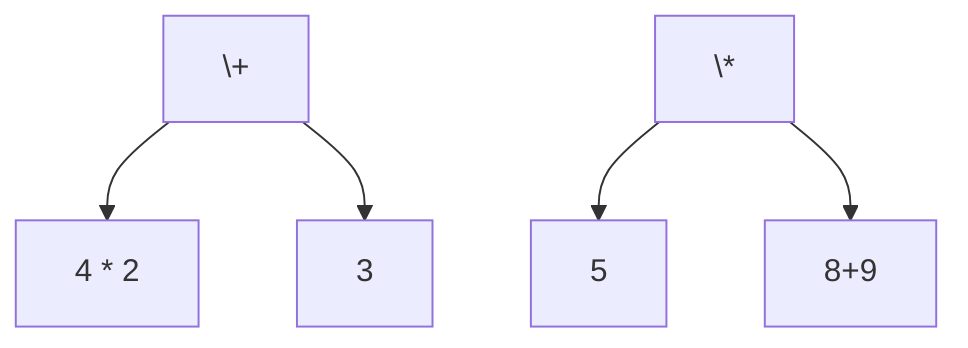

# Chap I  线性表

!!! abstract
	本文主要内容是线性表的概念与实现. 常见的线性表分为连续数组(顺序表), 链表, 栈, 队列.

## 1. 1 顺序表(Contiguous List)

---

这是相当常见的一种线性表, 也是最常用的线性表. 一般我们称这种在内存上连续的表为**顺序表**, `C++` 中即为 `vector` 或者一般数组. 这类数据结构相当简单为大家所熟悉, 此处不再过多赘述.

## 1. 2 链表(Linked List)

---

下图是单向链表, 双向链表和环表的示意图(设计头和尾根据实际情况进行. 一般而言仅仅使用头即可, 无需尾浪费内存空间).



- 单向链表 ADT[^1]

| 函数名        | 返回值                                                                                 |
| ---------- | ----------------------------------------------------------------------------------- |
| size       | 返回链表中的元素数量(即节点数量)                                                                   |
| is_empty   | 返回链表是否为空的布尔值                                                                        |
| next       | 返回当前节点指针对应的下一个节点指针                                                                  |
| get_front  | 返回链表首个有有效 `val` 值节点指针对应的 `val` 值                                                    |
| get        | 返回给定的节点指针或者下标处对应的节点的 `val` 值                                                        |
| change     | 修改给定的节点指针或者下标处对应的节点的 `val` 值为用户输入的值, 返回修改后的值                                        |
| push_front | 在链表的头部插入新元素, 返回空值                                                                   |
| insert     | 将给定的节点指针或者下标处对应的节点的 `next` 指针记为旧指针, 将 `next` 指向输入的新节点, 并让新节点的 `next` 指针改为旧指针, 返回空值. |
| remove     | 移除指定节点(同堂根据节点指针或者下标)的后继节点, 返回空值.                                                    |
| clear      | 清空链表, 返回空值.                                                                         |

### 1. 2. 1 基本结构: 节点定义 & 基本操作函数

首先定义基本的节点.

```cpp
template <typename T>
class LinkedList {
 private:
    struct Node {
     private:
        T _value;
        Node* _next;

     public:
        Node() : _next(nullptr) {}
        Node(T const& value) : _value(value), _next(nullptr) {}
    };
};
```

接下来添加访问器函数, 获取节点的 `_value` 值与 `_next` 指针.

```cpp hl_lines="13 14"
template <typename T>
class LinkedList {
 private:
    struct Node {
     private:
        T _value;
        Node* _next;

     public:
        Node() : _next(nullptr) {}
        Node(T const& value) : _value(value), _next(nullptr) {}

        T const& get_val() const { return this->_value; }
        Node* get_next() const { return this->_next; }
    };
};
```

!!! tip
	为什么第 13 行使用的是 `Node* get_next()` 而不是 `Node* const& get_next()` 呢? 这是为了避免利用这一函数对节点进行数据篡改. 换句话说, 前一个取值函数本身确实无法修改内部内容, 但是这一取指针函数可以永久修改指针指向的值(因为使用了取引用). 这是不安全的, 而改用副本则无此问题.

而后添加设置器函数, 可以设置节点的 `_value` 值与 `_next` 指针.

```cpp hl_lines="9 10"
template <typename T>
class LinkedList {
		
		...
		
        T const& get_val() const { return this->_value; }
        Node* get_next() const { return this->_next; }

        void set_val(T const& val) { this->_value = val; }
        void set_next(Node* next) { this->_next = next; }
        
        ...
};
```

这样, 我们得到了一个完整可用的节点结构体

```cpp
template <typename T>
class LinkedList {
 private:
    struct Node {
     private:
        T _value;
        Node* _next;

     public:
        Node() : _value(), _next(nullptr) {}
        Node(T const& value) : _value(value), _next(nullptr) {}

        T const& get_val() const { return this->_value; }
        Node* get_next() const { return this->_next; }

        void set_val(T const& val) { this->_value = val; }
        void set_next(Node* next) { this->_next = next; }
    };
};
```

接下来我们实现 `LinkedList`. 首先完成其构造函数与析构函数(注意此处的 `size` 指代实际元素数量, 而非实际节点数量. 因为头节点不存值, 所以即使初始化时已经存在了一个头节点, `size` 值仍指定为 0. 我们对此有一个专门的称呼, 即**哑节点(dummy node)**)

```cpp
template <typename T>
class LinkedList {
 private:
	struct Node { ... };

    Node *_head;
    size_t _size;

 public:
    LinkedList() : _size(0), _head(new Node()) {}
    
    ~LinkedList() {
        Node* currentPtr = this->_head;
        while (currentPtr != nullptr) {
            Node* nextPtr = currentPtr->get_next();
            delete currentPtr;
            currentPtr = nextPtr;
        }
    }
};
```

原博客的作者还添加了迭代器. 迭代器是一种将具体指针抽象化的抽象层, 例如上述的链表中我们查询对应的指针时相当麻烦, 改用迭代器就可以使用类似于 `i++` 的方式简洁优雅地完成查询.

如前面所述, 迭代器就是将具体指针抽象化的抽象层, 因此我们只需要存储一个内部的值, 即指向节点的指针. 要完成这个迭代器, 至少需要重载这几个运算符: `++`, `==`, `!=`, 并且在外层(即链表层) `begin()`, `end()` 两个返回迭代器的函数. 同样, 我们至少需要为迭代器设置拷贝构造函数. 具体实现后的完整代码如下

```cpp
#include <cstddef>

template <typename T>
class LinkedList {
 private:
    struct Node {
     private:
        T _value;
        Node* _next;

     public:
        Node() : _value(), _next(nullptr) {}
        Node(T const& value) : _value(value), _next(nullptr) {}

		/* 
		* 此处额外添加了适配迭代器的取值函数, 可以直接借此修改值. 
		* 保留 const 返回类型方便 const 情况下的取值 
		*/
        T const& get_val() const { return this->_value; }
		T& get_val() { return this->_value; }    
		
        Node* get_next() const { return (this->_next != nullptr) ? this->_next : nullptr; }

        void set_val(T const& val) { this->_value = val; }
        void set_next(Node* next) { this->_next = next; }
    };

    struct Iterator {
     private:
        Node* _ptr;

     public:
        Iterator(Node* ptr) : _ptr(ptr) {}

		// 常值取值函数, 重载运算符 *()
        T const& operator*() const { return _ptr->get_val(); }  
        // 非常值取值函数, 重载运算符 *()
        T& operator*() { return _ptr->get_val(); }
        // 左增函数, 重载运算符 ++()
        Iterator& operator++() { 
	        _ptr = (_ptr != nullptr ? _ptr->get_next() : nullptr); 
	        return *this; 
	    }
        /* 
        * 右增函数, 重载运算符 ()++. 
        * 此处非引用是因为返回的是自增前的拷贝值, 新值因为自增直接引用的话和前面没有区别; 
        * 此处 int 并非整型, 是表示后置 ++ 的占位符 
        */
        Iterator operator++(int) { 
	        Iterator temp(*this); _ptr = (_ptr != nullptr ? _ptr->get_next() : nullptr); 
	        return temp; 
	    }    
        
        // == & != 重载运算符, 形参 rhs 表示右值, 此处 const& 就是指在不修改值前提下引用
        bool operator==(Iterator const& rhs) const { return _ptr == rhs._ptr; }
        bool operator!=(Iterator const& rhs) const { return _ptr != rhs._ptr; }
    };

    Node *_head;
    size_t _size;

 public:
    LinkedList() : _size(0), _head(new Node()) {}
    
    ~LinkedList() {
        Node* currentPtr = this->_head;
        while (currentPtr != nullptr) {
            Node* nextPtr = currentPtr->get_next();
            delete currentPtr;
            currentPtr = nextPtr;
        }
    }

	// 头节点是哑节点, 因此需要用下一个值作为真正的头节点
    Iterator begin() { return Iterator(_head->get_next()); }
    // 链表的最后一个指向的指针就是 nullptr
    Iterator end() { return Iterator(nullptr); }
};
```

当然, 只有此部分使用单链表仍然是不够灵活的. 我们完全可以添加一个`[]` 运算符重载, 实现类似于数组的访问方式. 同时可以利用已有的元数据完善一些函数

```cpp
template<typename T>
class LinkedList {
	
	...
	
 public:
 
	...
 
	T& operator[](int i) {
		Node* temp = _head->get_next();
		while (i--) { 
			temp = temp->get_next() ; 
		} 
		return temp->get_val(); 
	}
	
	size_t size() { return _size; }
	bool is_empty() { return _size == 0; }
}
```

!!! tip
	在现代 `C++` 中之所以保留不设边界检查的 `[]` 操作符, 很大程度上是为了保证这一操作的效率. 这一点在数据量极其大的时候十分明显. 在各个函数的声明中, 可能大家会奇怪为什么有些是常量, 有些是引用量等等, 实际上很大一部分都是实际编程中积累经验改进得到的. 总之, `C++` 中仍然保留的 `C` 特性的原因实际上远远不止于保持兼容性, 很多时候是因为 `C` 本身就是很优秀的程序语言, 本身就有许多可取之处.

为了方便头部操作, 我们常常需要额外添加一个返回首个有效项值的函数

```cpp
T& head() { return _head->get_next()->get_val(); }
```

### 1. 2. 2 增删查

!!! note
	实际上, 有了迭代器之后可以直接使用算法库中的 `find` 函数. 不过为了保证自身的完整性, 这里也会提供非算法库的 `find` 函数. 
	
	另外, 目前实现这些数据结构的目的是学习原理, 实现过程会显得相当混乱. 实际上(几乎)所有编译器的 `STL` 库都相当优秀, 会考虑大量其他问题(如何时适合插入 `noexcept` 优化性能). 不过这会涉及大量不属于算法设计领域的问题, 因此这里不做赘述.
	
	程序编程过程中必须要注意, 任何一项与 `delete` 相关的操作进行之前必须要确保前后链表结构不被破坏.

在完善增删查函数之前, 我们先重载更丰富的构造函数

```cpp
/* 预留链表大小的构造函数 */
LinkedList(size_t size) : _size(size) {
	_head = new Node();
	Node* ptr = _head;
	while (size--) {
		Node* temp = new Node();
		ptr->set_next(temp);
		ptr = temp;
	}
}

/* 预留链表大小和默认值的构造函数 */
LinkedList(size_t size, T const& val) : _size(size) {
	_head = new Node();
	Node* ptr = _head;
	while (size--) {
		Node* temp = new Node(val);
		ptr->set_next(temp);
		ptr = temp;
	}
}
```

在此基础上, 我们添加 `push_front` 在头(哑)节点后面新增节点的函数, `insert` 实现类似于数组风格的新增节点和在某个节点后面新增节点的功能(注意每次操作同时要修改表的元数据)

```cpp
void push_front(T const& ele) { 
	Node* temp = _head->get_next();
	_head->set_next(new Node(ele));
	_head->get_next()->set_next(temp);
	_size++;
}

void insert(size_t i, T const& ele) {
	if (i >= _size) {
		// insert 必须要防止越界
		throw std::out_of_range("Insert position out of range");
	}
	Node* temp = _head;
	while (i--) {
		temp = temp->get_next();
	}
	Node* temp_ = temp->get_next();
	temp->set_next(new Node(ele));
	temp->get_next()->set_next(temp_);
	// 记住每次进行增删之后都要修改元数据
	_size++;
}

void insert(Node* &ptr, T const& ele) {
	Node* temp = ptr->get_next();
	ptr->set_next(new Node(ele));
	ptr->get_next()->set_next(temp);
	_size++;
}
```

接下来添加 `remove` 删除函数. 其参数可以为某个节点(会删除下一个节点), 也可以为类似于数组那样的下标. 另外也可以添加 `clear` 清空函数, 将 `size` 清空

```cpp
void remove(size_t i) {
    if (i >= _size) {
        throw std::out_of_range("Insert position out of range");
    }
	Node* temp = _head;
	while(i--) {
        temp = temp->get_next();
    }
    Node* rig = temp->get_next()->get_next();
    delete temp->get_next();
    temp->set_next(rig);
    _size--;
}

void remove(Node* ptr) {
    Node* temp = ptr->get_next()->get_next();
    delete ptr->get_next();
    ptr->set_next(temp);
    _size--;
}

void clear() {
	Node* pre = _head->get_next();
    Node* now = pre->get_next();
    while(pre != nullptr) {
        delete pre;
        pre = now;
        now = now->get_next();
    }
    _size = 0;
}
```

接下来是 `find` 查找函数的部分. 如果未查找到则返回 `end()` 值(即 `Iterator(nullptr)`).

```cpp
Iterator find(T const& ele) {
	for (auto it = this->begin(); it != this->end(); it++) {
		if (ele == *it) { return it; }
	}
	return this->end();
}
```

!!! tip
	上述程序可能存在细节上的问题, 尤其是和越界问题相关的部分. 这一部分算是在下刻意留下的(哈哈哈当然你认为我懒也没问题). 如果需要参考程序的话可以查看我比较认真写的[双向链表](https://github.com/HollowDobt/algorithm/blob/main/linked-list/llist.cpp)版本, 实现方法是现代 `C++` 语言并且也是 `C++` 风格.

### 1. 2. 3 链表的应用

#### 1. 2. 3. 1 基数排序[^2]

基数排序, 简单来说是基于分类思想的排序方式. 其最大的特点是原理上不需要进行数之间的比较, 每一轮根据所有数的某一位数调整排列顺序, 保证第 $X$ 轮后每个数的后面 $X$ 位全部排序完成, 同时保证在第 $X+1$ 轮以及之后的排序调整有更高优先级.

下面给出一个实例(桶 $0$ 表示桶内对应位数的值为 $0$, 如 $0720$ 在 $Pass1$ 中对应位数值为 $0$, 故排在桶 $0$. 其余同理)



这一排序的具体代码实现如下(以 $10$ 位整数为例)

```cpp
#include <cstdint>
#include <list>
#include <vector>

using namespace std;
using u64 = uint64_t;

vector<u64> radixSort(vector<u64> const& lst_c) {
    vector<u64> lst(lst_c);
    u64 pos = 0, exp = 1;
    while(++pos <= 10 && (exp *= 10)) {
        vector<list<u64>> buc(10);
        for(auto const& num : lst) {
            buc[(num/(exp/10)) % 10].push_back(num);
        }
        lst.clear();
        for(auto const& ls : buc) {
            for (auto const& num : ls) {
                lst.push_back(num);
            }
        }
    }
    return lst;
}
```

!!! tip
	如果你和我一样之前已经学过其他基于比较的排序方式, 直觉上一定会发现, 基数排序的理论时间复杂度会小很多. 实际上也是, 理论上 $O(N\log N) < O(N)$, 其时间复杂度是线性的. 甚至其空间复杂度也仅有 $O(N)$ 级别. 那么, 为什么大部分程序语言使用的排序方式都是快速排序或者混合了多种基于比较的排序呢?
	
	虽然理论上基数排序的时间复杂度低于快速排序或者其他混合排序, 但是实际使用与优化中需要考虑 `CPU` 的缓存机制. 基数排序因为多轮全量扫描机制, 其缓存命中率显著低于快速排序等算法; 再如上面程序实现, 基数排序中我们需要进行多轮的全部数据交换, 实际上的时间常数常常难以忽略, 尤其是在数据量较小的前提下. 更加致命的是, 基数排序很难应用在浮点数情况上, 或者说基数排序只适合用在位数结构上一致的数据. 因此, 在工程实现上, 为了达到一般情况下排序效率的最大化, 我们常常会使用其他排序方式, 而非理论上极快的基数排序.[^3]
	
	尽管如此, 基数排序的应用仍然相当广泛. 其性能在现代计算机缓存大小与内存带宽大幅度上升后也随之增强, 在如 `IP` 地址, 哈希值, `ID` 排序等位数固定的场景上表现相当优秀.[^4]

#### 1. 2. 3. 2 多项式乘法[^5]

使用链表完成多项式乘法相当简单. 使用模拟乘法竖式的思路即可.

我们顺序地存储 $N$ 个二元组, 每个二元组包括系数项与指数项. 每轮需要查找有序链表中是否存有相同的指数项. 如果有, 那么直接将系数项乘法得到的值加到已有的系数项中; 否则遍历到 `nullptr` 或者当前项的指数项已经大于乘法得到的指数项, 在末尾或者当前项的节点前部插入新节点.

具体程序按照上述思路即可完成, 这里不再赘述.

#### 1. 2. 3. 3 多重表问题[^6]

书上给出了非常有名的例子, 即简单多重关系问题. 其思想类似于图.

我们设一共有 $N$ 位学生, 同时有 $M$ 个课程, 每个学生最多选择 $5$ 种课程, 那么直接使用顺序表需要 $M\times N$ 大小的空间, 也就是下图的关系



而链表版本仅需要 $5\times N$ 的空间



唯一的缺点是不方便直接访问某个学生或者课程情况. 不过可以通过额外构建元数据表实现这一点.


## 1. 3 栈(Stack)
---

### 1. 3. 1 栈的实现

栈的实现方式多种多样. 其特点是 `FILO(First In Last Out)`, 也就是先进后出, 类似于鸡尾酒, 冰激凌的唯一出口式模型. 

一般而言, 我们只能获取栈顶的元素, 并且只能对栈顶元素进行操作. 或者说栈顶元素是唯一可见元素. 下图是一个栈的示意图



栈的基本操作包括 `Top`(检查栈顶), `Push`(将元素放入栈顶), `Pop`(取出栈顶元素), 只需要将前面的链表进行简单改造即可. 具体而言, 只需保留这几项操作, 删除其他操作即可.

但是, 使用链表的代价是极其可怕的, 因为对于堆空间(动态内存)的开辟需要花费大量的常数时间. 因此, 更加常见的方式是直接使用普通数组, 也就是线性表构建. 这种方式的优点是避开了时间代价高昂的动态内存, 缺点是事先需要确定适合的数组大小, 容易造成严重的内存安全隐患.

这里给出最简单的栈实现

```cpp
#include <cstddef>
#include <iostream>
#include <stdexcept>

using namespace std;

template <typename T, size_t N>
class Stack {
   private:
    size_t top_ptr;
    T array[N];

   public:
    Stack() : top_ptr(0) {}
    // 使用的是栈空间, 不需要额外的析构函数

    T& top() {
        if (top_ptr > 0) {
            return array[top_ptr - 1];
        }
        throw runtime_error("Stack is empty!");
    }

    T const& top() const {
        if (top_ptr > 0) {
            return array[top_ptr - 1];
        }
        throw runtime_error("Stack is empty!");
    }

    // 这里没有体现边界检查与扩容. 实际上的习惯是会添加 is_full 和 is_empty 两个函数专门辅助边界检查.
    void push(T const& num) { array[++top_ptr - 1] = num; }
    T pop() { return array[top_ptr-- - 1]; }
    size_t const& size() const noexcept { return top_ptr; }
};

int main(void) {
    Stack<int, 1000> stack;
    stack.push(100);
    cout << stack.pop() << " " << stack.size() << endl;

    return 0;
}
```

使用动态内存实现同样是可行的, 甚至更加灵活. 不过在那种情况下许多操作甚至栈本身我们可以直接使用标准库的 `vector` 完成, 因此这里不给出动态内存的方式.

### 1. 3. 2 栈的应用

#### 1. 3. 2. 1 符号平衡(符号语法检查)[^7]

我们写程序的时候, 尤其是诸如 `lisp` 那样包含巨量恐怖括号的程序时, 我们需要检查括号是否闭合. 这是一件十分重要的事, 因为一旦括号未闭合, 缺少专门的符号平衡解析器的情况下很容易产生几百上千行程序代码的报错. 我们可以引入栈解决这一问题.

我们将一对括号分为开放和闭合两类, 其中一对括号的左边部分就是开放的, 右边部分就是闭合的. 每当遇到开放符号的时候就将符号记录到栈顶, 而每当遇到闭合符号的时候就检查是否与栈顶元素相同. 如果栈顶元素根本不存在, 报错缺少左括号. 如果不同, 那么就产生配对错误的报错. 如果相同, 那么就将栈顶符号推出, 栈顶移到下一符号. 在文末如果栈中还残留有元素, 证明前面有括号未闭合(这意味着我们需要存入的不仅仅是元素本身, 还需要存储元素的位置), 此时执行报错.

符号平衡算法是很经典的**在线(on-line)算法**, 因为它不需要读完整个文本就可以直接检查到最前面的符号不配对问题.

!!! tip
	**在线算法** 指的是可以流式处理数据的算法. 准确的讲, 在输入数据 **逐步到达** 的过程中, 算法能 **实时处理**, 并在任何时刻给出当前处理结果, 而不需要等待全部输入都到齐的算法就是在线算法.
	
	**离线算法** 指的是必须等到 **完整输入数据** 都准备好之后才能开始计算的算法.

下面是对于符号平衡算法的实现. 当然, 诸如 `gcc` 等编译器的语法解析的符号平衡算法远没有这么简单. 简单来讲, 下面这个程序源代码本身的符号平衡就会被这个算法识别为"非法". 大家可以猜猜是哪里, 是为什么, 然后自己编译试试

```cpp
#include <cstddef>
#include <fstream>
#include <iostream>
#include <stack>
#include <string>

using namespace std;

int main(int argc, char const* argv[]) {
    // 其中另一个参数 argv[1] 指向需要检查语法的文件地址
    if (argc != 2) {
        cerr << "Input type is undefined" << endl;
        return 1;
    }

    ifstream inFile(argv[1]);
    string leftLst = "([{", righLst = ")]}";

    if (!inFile) {
        cerr << "No such file: " << argv[1] << endl;
        return 1;
    }

    string line;
    stack<pair<size_t, pair<size_t, size_t>>> lineRead;
    size_t lineNum = 0;

    while (getline(inFile, line) && ++lineNum) {
        size_t rowNum = 0;

        for (char const& ch : line) {
            ++rowNum;

            // bool handled = false;

            for (size_t ptr_ex = 0; ptr_ex < leftLst.size(); ++ptr_ex) {
                if (ch == leftLst[ptr_ex]) {
                    lineRead.push({ptr_ex, {lineNum, rowNum}});
                    // handled = true;
                    // goto 就是简单的跳转执行, 用来取代上面的 handled 标注
                    goto next_turn;
                    break;
                }
            }

            // if (handled == true) continue;

            for (size_t ptr_ex = 0; ptr_ex < righLst.size(); ++ptr_ex) {
                if (ch == righLst[ptr_ex]) {
                    if (lineRead.empty() == true ||
                        lineRead.top().first != ptr_ex) {
                        cout << "Unpaired symbol detected\n"
                             << "In [line, row] -> [" << lineNum << ", "
                             << rowNum << "]: unpaired symbol `" << ch << "`"
                             << endl;

                        if (lineRead.empty() == false) {
                            cout << "Expected symbol: "
                                 << righLst[lineRead.top().first] << endl;
                        } else {
                            cout << "No left symbol found." << endl;
                        }
                        return 0;
                    }

                    lineRead.pop();
                    break;
                }
            }

        next_turn:;
        }
    }

    if (lineRead.empty() != true) {
        cout << "Unpaired symbol detected\n"
             << "In [line, row] -> [" << lineRead.top().second.first << ", "
             << lineRead.top().second.second << "]: unpaired symbol `"
             << leftLst[lineRead.top().first] << "`" << endl;

        return 0;
    }

    cout << "No error found." << endl;

    return 0;
}
```

#### 1. 3. 2. 2 从中缀表达式到后缀表达式[^8]

对于一个乘法与加法混合问题: $4 \times 2 + 3 + 5 \times (8+9) = ?$, 我们如何使用程序语言完成计算?

相信不少同学在学习算法与数据结构基础之前就听说过, 单纯的利用程序语言已有的计算规则设计计算器并不困难, 但是要自己不利用程序语言内置的计算规则自行进行解析并不是一件简单的事. 事实上, 利用栈就可以做到这一点.

最直观的解析思路如下. 我们只考虑加减乘除四则运算和括号, 那么运算优先级有: 括号 $>$ 乘除 $>$ 加减. 因此, 我们可以将上述表达式按照**括号** $\longrightarrow$ **乘除** $\longrightarrow$ **加减**的顺序进行解析, 也就是:

$$
\begin{align*}
=&4\times2+3+5\times(8,9,+)\\
=&(4,2,\times)+3+(5,(8,9,+),\times)\\
=&((4,2,\times),3,+)+(5,(8,9,+),\times)=(((4,2,\times),3,+),(5,(8,9,+),\times),+)
\end{align*}
$$

接下来就是见证奇迹的时刻! 打开括号, 我们得到这样一串表达式: $4,2,\times,3,+,5,8,9,+\times,+$. 这其实就是**逆波兰表达式**, 亦称**后缀表达式**. 现在我们按照如下思路进行计算.

我们规定, 每当读到后缀表达式的数字时将数字推送到栈顶, 每当读到符号时将栈顶弹出两次(也就是栈顶元素和栈顶下一个元素), 并直接对这两个数按照运算符完成运算, 将得到的结果重新放回栈顶. 比如, 一开始的时候读到 $4$, 将 $4$ 入栈; 接着读到 $2$, 入栈; 而后读到 $\times$, 将 $4$ 和 $2$ 相乘得到 $8$, 而后将 $8$ 送回栈顶, 接下来持续进行相同操作. 具体计算如下($ST$ 表示栈, $OP$ 表示当前读到的运算符)

$$
\begin{align*}
ST&=\{4\}\\
ST&=\{4,2\}\\
ST&=\{4,2\},\ OP=\times\longrightarrow ST=\{\},RES=4\times2=8\longrightarrow ST=\{8\}\\
ST&=\{8,3\}\\
ST&=\{8,3\},\ OP=+,\longrightarrow ST=\{\}, RES=8+3=11\longrightarrow ST=\{11\}\\
ST&=\{11,5\}\\
ST&=\{11,5,8\}\\
ST&=\{11,5,8,9\}\\
ST&=\{11,5,8,9\},\ OP=+,\longrightarrow ST=\{11,5\},RES=8+9=17\longrightarrow ST=\{11,5,17\}\\
ST&=\{11,5,17\},\ OP=\times,\longrightarrow ST=\{11\},RES=5\times17=85\longrightarrow ST=\{11,85\}\\
ST&=\{11,85\},\ OP=+,\longrightarrow ST=\{\},RES=11+85=96\longrightarrow ST=\{96\}\\
\end{align*}
$$

最终栈存留的内容 $96$ 就是运算答案.

很神奇不是吗? 可是, 这为什么是对的呢? 为什么后缀表达式可以直接打开括号, 而中缀表达式不可以呢? 实际上, 后缀表达式只是将括号, 运算顺序直接写在了表达式中, 上面的操作就是对这一新表达式计算规则的描述. 换句话说, 我们将运算规则复杂的中缀表达式归纳成了运算规则唯一确定简单的后缀表达式.

如果使用树结构中节点之间的关系来表达, 那么我们这一展开过程和二叉树无异. 我们考虑下面这棵树



其中 $S_1$ 和 $S_2$ 分别是左节点和右节点. 那么这个运算过程就是 $S_1\ S_2\ Operator$. 实际上 $S_1$ 对其下面的左节点与右节点执行操作与 $S_1\ S_2\ Operator$ 方式没有区别, 并且仍然严格保证从左到右三元唯一匹配格式. 使用实例进行更加明确的解释, 即逐步构造树:

首先生成这样一棵树. 使用后缀表达式表述为 $(4\times2+3,5\times(8+9),+)=(4\times2+3)\ (5\times(8+9))\ +$.



接下来继续生成左子树和右子树



因此上面的表达式进一步变为 $(4\times 2)\ (3)\ +\ (5)\ (8+9)\ +$. 到了这一步, 如果你是一个细心的人, 你一定会发现, 每次展开就是严格的三元组. 换句话说, 这个三元唯一匹配不是因为其他任何原因, 就是源自于展开的树以及树的来源严格遵循运算规则的中缀表达式. 因为树本身的三元匹配唯一严格, 并且树本身包含了运算顺序(运算规则), 因此后缀表达式就是没有问题的. 这也就是说, 利用后缀表达式 + 栈进行计算本质上和利用二叉树解析中缀表达式进行递归计算是一致的, 后缀表达式就是把整棵表达式树按**后序遍历**写成一行.

所谓后序遍历, 就是将树的三个节点按照 $S_1\longrightarrow S_2\longrightarrow Operator$ (左子结点 右子节点 父节点)的顺序遍历为唯一表达式的方法.


[^1]:
	*C++算法编程指南 0.1 文档* <https://majorli.github.io/algo_guide/ch03/sec01/318_linkedlist_2.html>

[^2]:
	*Data Structures and Algorithm Analysis in C, Second Edition 3. 2. 7*  P54

[^3]:
	*A Fast Radix Sort, I.J.DAVIS, Department of Computing and Physics, Wilfrid Laurier University, Waterloo, Ontario, Canada N2L* Table 2 <https://cs.uwaterloo.ca/~ijdavis/fastsort.pdf>

[^4]:
	*Fast Sort on CPUs, GPUs and Intel MIC Architectures, Nadathur Satish, Changkyu Kim, Jatin Chhugani, Anthony D. Nguyen, Victor W. Lee, Daehyun Kim, Pradeep Dubey Throughput Computing Lab.* <https://www.intel.com/content/dam/www/public/us/en/documents/technology-briefs/intel-labs-radix-sort-mic-report.pdf>

[^5]:
	*Data Structures and Algorithm Analysis in C, Second Edition 3. 2. 7*  P53

[^6]:
	*Data Structures and Algorithm Analysis in C, Second Edition 3. 2. 7*  P55

[^7]: 
	*Data Structures and Algorithm Analysis in C, Second Edition 3. 3. 3*  P70

[^8]: 
	*Data Structures and Algorithm Analysis in C, Second Edition 3. 3. 3*  P71