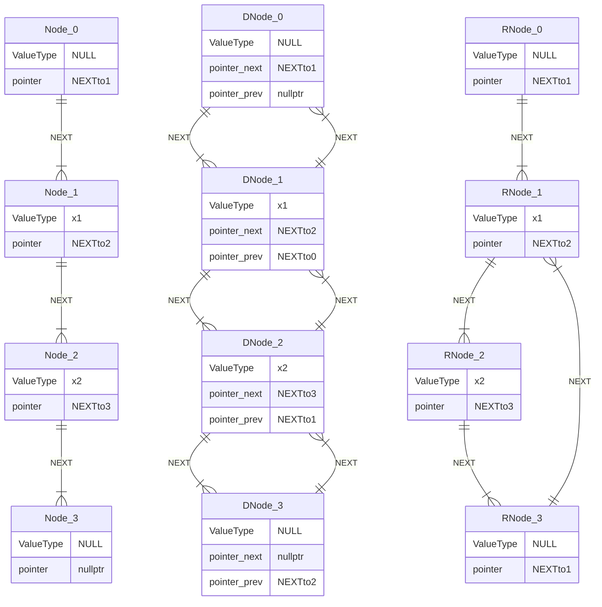

# Chap I  线性表

!!! abstract
	本文主要内容是线性表的概念与实现. 常见的线性表分为连续数组(顺序表), 链表, 栈, 队列.

## 1. 1 顺序表

这是相当常见的一种线性表, 也是最常用的线性表. 一般我们称这种在内存上连续的表为**顺序表**, `C++` 中即为 `vector` 或者一般数组. 这类数据结构相当简单为大家所熟悉, 此处不再过多赘述.

## 1. 2 链表

下图是单向链表, 双向链表和环表的示意图(设计头和尾根据实际情况进行. 一般而言仅仅使用头即可, 无需尾浪费内存空间).



- 单向链表 ADT[^1]

| 函数名        | 返回值                                                                                 |
| ---------- | ----------------------------------------------------------------------------------- |
| size       | 返回链表中的元素数量(即节点数量)                                                                   |
| is_empty   | 返回链表是否为空的布尔值                                                                        |
| next       | 返回当前节点指针对应的下一个节点指针                                                                  |
| get_front  | 返回链表首个有有效 `val` 值节点指针对应的 `val` 值                                                    |
| get        | 返回给定的节点指针或者下标处对应的节点的 `val` 值                                                        |
| change     | 修改给定的节点指针或者下标处对应的节点的 `val` 值为用户输入的值, 返回修改后的值                                        |
| push_front | 在链表的头部插入新元素, 返回空值                                                                   |
| insert     | 将给定的节点指针或者下标处对应的节点的 `next` 指针记为旧指针, 将 `next` 指向输入的新节点, 并让新节点的 `next` 指针改为旧指针, 返回空值. |
| remove     | 移除指定节点(同堂根据节点指针或者下标)的后继节点, 返回空值.                                                    |
| clear      | 清空链表, 返回空值.                                                                         |

### 1. 2. 1 基本结构: 节点定义 & 基本操作函数

首先定义基本的节点.

```cpp
template <typename T>
class LinkedList {
 private:
    struct Node {
     private:
        T _value;
        Node* _next;

     public:
        Node() : _next(nullptr) {}
        Node(T const& value) : _value(value), _next(nullptr) {}
    };
};
```

接下来添加访问器函数, 获取节点的 `_value` 值与 `_next` 指针.

```cpp hl_lines="13 14"
template <typename T>
class LinkedList {
 private:
    struct Node {
     private:
        T _value;
        Node* _next;

     public:
        Node() : _next(nullptr) {}
        Node(T const& value) : _value(value), _next(nullptr) {}

        T const& get_val() const { return this->_value; }
        Node* get_next() const { return this->_next; }
    };
};
```

!!! tip
	为什么第 13 行使用的是 `Node* get_next()` 而不是 `Node* const& get_next()` 呢? 这是为了避免利用这一函数对节点进行数据篡改. 换句话说, 前一个取值函数本身确实无法修改内部内容, 但是这一取指针函数可以永久修改指针指向的值(因为使用了取引用). 这是不安全的, 而改用副本则无此问题.

而后添加设置器函数, 可以设置节点的 `_value` 值与 `_next` 指针.

```cpp hl_lines="9 10"
template <typename T>
class LinkedList {
		
		...
		
        T const& get_val() const { return this->_value; }
        Node* get_next() const { return this->_next; }

        void set_val(T const& val) { this->_value = val; }
        void set_next(Node* next) { this->_next = next; }
        
        ...
};
```

这样, 我们得到了一个完整可用的节点结构体

```cpp
template <typename T>
class LinkedList {
 private:
    struct Node {
     private:
        T _value;
        Node* _next;

     public:
        Node() : _value(), _next(nullptr) {}
        Node(T const& value) : _value(value), _next(nullptr) {}

        T const& get_val() const { return this->_value; }
        Node* get_next() const { return this->_next; }

        void set_val(T const& val) { this->_value = val; }
        void set_next(Node* next) { this->_next = next; }
    };
};
```

接下来我们实现 `LinkedList`. 首先完成其构造函数与析构函数(注意此处的 `size` 指代实际元素数量, 而非实际节点数量. 因为头节点不存值, 所以即使初始化时已经存在了一个头节点, `size` 值仍指定为 0. 我们对此有一个专门的称呼, 即**哑节点(dummy node)**)

```cpp
template <typename T>
class LinkedList {
 private:
	struct Node { ... };

    Node *_head;
    size_t _size;

 public:
    LinkedList() : _size(0), _head(new Node()) {}
    
    ~LinkedList() {
        Node* currentPtr = this->_head;
        while (currentPtr != nullptr) {
            Node* nextPtr = currentPtr->get_next();
            delete currentPtr;
            currentPtr = nextPtr;
        }
    }
};
```

原博客的作者还添加了迭代器. 迭代器是一种将具体指针抽象化的抽象层, 例如上述的链表中我们查询对应的指针时相当麻烦, 改用迭代器就可以使用类似于 `i++` 的方式简洁优雅地完成查询.

如前面所述, 迭代器就是将具体指针抽象化的抽象层, 因此我们只需要存储一个内部的值, 即指向节点的指针. 要完成这个迭代器, 至少需要重载这几个运算符: `++`, `==`, `!=`, 并且在外层(即链表层) `begin()`, `end()` 两个返回迭代器的函数. 同样, 我们至少需要为迭代器设置拷贝构造函数. 具体实现后的完整代码如下

```cpp
#include <cstddef>

template <typename T>
class LinkedList {
 private:
    struct Node {
     private:
        T _value;
        Node* _next;

     public:
        Node() : _value(), _next(nullptr) {}
        Node(T const& value) : _value(value), _next(nullptr) {}

		/* 
		* 此处额外添加了适配迭代器的取值函数, 可以直接借此修改值. 
		* 保留 const 返回类型方便 const 情况下的取值 
		*/
        T const& get_val() const { return this->_value; }
		T& get_val() { return this->_value; }    
		
        Node* get_next() const { return (this->_next != nullptr) ? this->_next : nullptr; }

        void set_val(T const& val) { this->_value = val; }
        void set_next(Node* next) { this->_next = next; }
    };

    struct Iterator {
     private:
        Node* _ptr;

     public:
        Iterator(Node* ptr) : _ptr(ptr) {}

		// 常值取值函数, 重载运算符 *()
        T const& operator*() const { return _ptr->get_val(); }  
        // 非常值取值函数, 重载运算符 *()
        T& operator*() { return _ptr->get_val(); }
        // 左增函数, 重载运算符 ++()
        Iterator& operator++() { 
	        _ptr = (_ptr != nullptr ? _ptr->get_next() : nullptr); 
	        return *this; 
	    }
        /* 
        * 右增函数, 重载运算符 ()++. 
        * 此处非引用是因为返回的是自增前的拷贝值, 新值因为自增直接引用的话和前面没有区别; 
        * 此处 int 并非整型, 是表示后置 ++ 的占位符 
        */
        Iterator operator++(int) { 
	        Iterator temp(*this); _ptr = (_ptr != nullptr ? _ptr->get_next() : nullptr); 
	        return temp; 
	    }    
        
        // == & != 重载运算符, 形参 rhs 表示右值, 此处 const& 就是指在不修改值前提下引用
        bool operator==(Iterator const& rhs) const { return _ptr == rhs._ptr; }
        bool operator!=(Iterator const& rhs) const { return _ptr != rhs._ptr; }
    };

    Node *_head;
    size_t _size;

 public:
    LinkedList() : _size(0), _head(new Node()) {}
    
    ~LinkedList() {
        Node* currentPtr = this->_head;
        while (currentPtr != nullptr) {
            Node* nextPtr = currentPtr->get_next();
            delete currentPtr;
            currentPtr = nextPtr;
        }
    }

	// 头节点是哑节点, 因此需要用下一个值作为真正的头节点
    Iterator begin() { return Iterator(_head->get_next()); }
    // 链表的最后一个指向的指针就是 nullptr
    Iterator end() { return Iterator(nullptr); }
};
```

当然, 只有此部分使用单链表仍然是不够灵活的. 我们完全可以添加一个`[]` 运算符重载, 实现类似于数组的访问方式. 同时可以利用已有的元数据完善一些函数

```cpp
template<typename T>
class LinkedList {
	
	...
	
 public:
 
	...
 
	T& operator[](int i) {
		Node* temp = _head->get_next();
		while (i--) { 
			temp = temp->get_next() ; 
		} 
		return temp->get_val(); 
	}
	
	size_t size() { return _size; }
	bool is_empty() { return _size == 0; }
}
```

!!! tip
	在现代 `C++` 中之所以保留不设边界检查的 `[]` 操作符, 很大程度上是为了保证这一操作的效率. 这一点在数据量极其大的时候十分明显. 在各个函数的声明中, 可能大家会奇怪为什么有些是常量, 有些是引用量等等, 实际上很大一部分都是实际编程中积累经验改进得到的. 总之, `C++` 中仍然保留的 `C` 特性的原因实际上远远不止于保持兼容性, 很多时候是因为 `C` 本身就是很优秀的程序语言, 本身就有许多可取之处.

为了方便头部操作, 我们常常需要额外添加一个返回首个有效项值的函数

```cpp
T& head() { return _head->get_next()->get_val(); }
```

### 1. 2. 2 增删查

!!! note
	实际上, 有了迭代器之后可以直接使用算法库中的 `find` 函数. 不过为了保证自身的完整性, 这里也会提供非算法库的 `find` 函数. 
	
	另外, 目前实现这些数据结构的目的是学习原理, 实现过程会显得相当混乱. 实际上(几乎)所有编译器的 `STL` 库都相当优秀, 会考虑大量其他问题(如何时适合插入 `noexcept` 优化性能). 不过这会涉及大量不属于算法设计领域的问题, 因此这里不做赘述.
	
	程序编程过程中必须要注意, 任何一项与 `delete` 相关的操作进行之前必须要确保前后链表结构不被破坏.

在完善增删查函数之前, 我们先重载更丰富的构造函数

```cpp
/* 预留链表大小的构造函数 */
LinkedList(size_t size) : _size(size) {
	_head = new Node();
	Node* ptr = _head;
	while (size--) {
		Node* temp = new Node();
		ptr->set_next(temp);
		ptr = temp;
	}
}

/* 预留链表大小和默认值的构造函数 */
LinkedList(size_t size, T const& val) : _size(size) {
	_head = new Node();
	Node* ptr = _head;
	while (size--) {
		Node* temp = new Node(val);
		ptr->set_next(temp);
		ptr = temp;
	}
}
```

在此基础上, 我们添加 `push_front` 在头(哑)节点后面新增节点的函数, `insert` 实现类似于数组风格的新增节点和在某个节点后面新增节点的功能(注意每次操作同时要修改表的元数据)

```cpp
void push_front(T const& ele) { 
	Node* temp = _head->get_next();
	_head->set_next(new Node(ele));
	_head->get_next()->set_next(temp);
	_size++;
}

void insert(size_t i, T const& ele) {
	if (i >= _size) {
		// insert 必须要防止越界
		throw std::out_of_range("Insert position out of range");
	}
	Node* temp = _head;
	while (i--) {
		temp = temp->get_next();
	}
	Node* temp_ = temp->get_next();
	temp->set_next(new Node(ele));
	temp->get_next()->set_next(temp_);
	// 记住每次进行增删之后都要修改元数据
	_size++;
}

void insert(Node* &ptr, T const& ele) {
	Node* temp = ptr->get_next();
	ptr->set_next(new Node(ele));
	ptr->get_next()->set_next(temp);
	_size++;
}
```

接下来添加 `remove` 删除函数. 其参数可以为某个节点(会删除下一个节点), 也可以为类似于数组那样的下标. 另外也可以添加 `clear` 清空函数, 将 `size` 清空

```cpp
void remove(size_t i) {
    if (i >= _size) {
        throw std::out_of_range("Insert position out of range");
    }
	Node* temp = _head;
	while(i--) {
        temp = temp->get_next();
    }
    Node* rig = temp->get_next()->get_next();
    delete temp->get_next();
    temp->set_next(rig);
    _size--;
}

void remove(Node* ptr) {
    Node* temp = ptr->get_next()->get_next();
    delete ptr->get_next();
    ptr->set_next(temp);
    _size--;
}

void clear() {
	Node* pre = _head->get_next();
    Node* now = pre->get_next();
    while(pre != nullptr) {
        delete pre;
        pre = now;
        now = now->get_next();
    }
    _size = 0;
}
```

接下来是 `find` 查找函数的部分. 如果未查找到则返回 `end()` 值(即 `Iterator(nullptr)`).

```cpp
Iterator find(T const& ele) {
	for (auto it = this->begin(); it != this->end(); it++) {
		if (ele == *it) { return it; }
	}
	return this->end();
}
```

!!! tip
	上述程序可能存在细节上的问题, 尤其是和越界问题相关的部分. 这一部分算是在下刻意留下的(哈哈哈当然你认为我懒也没问题). 如果需要参考程序的话可以查看我比较认真写的[双向链表](https://github.com/HollowDobt/algorithm/blob/main/linked-list/llist.cpp)版本, 实现方法是现代 `C++` 语言并且也是 `C++` 风格.

### 1. 2. 3 链表的应用

#### 1. 2. 3. 1 基数排序[^2]

首先简单介绍一下桶排序. 桶排序的思想类似于干部的投票选拔, 非常适用于


[^1]:
	*C++算法编程指南 0.1 文档* <https://majorli.github.io/algo_guide/ch03/sec01/318_linkedlist_2.html>

[^2]:
	*Data Structures and Algorithm Analysis in C, Second Edition 3. 2. 7*  P54