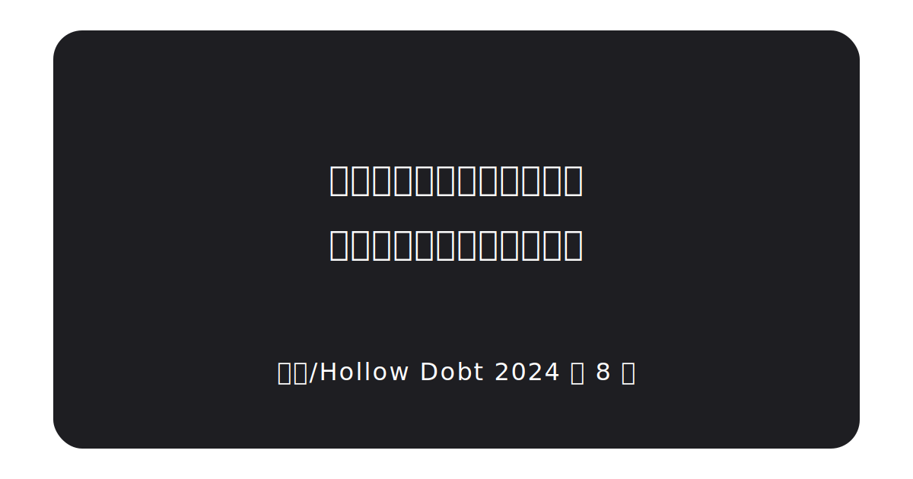

# Hollow's Library
---

---

!!! tip ""
	Hello? 这里是我的图书馆, 存储着许多(应该)有用的知识~ 欢迎你的批判性阅读, 希望这些东西可以帮到你.

### License

本项目采用 **CC BY-NC-SA 4.0** 作为博客内容的开源协议. 你首先应当满足条件下列条件

- **署名**: 您必须给出 [适当的署名 ](https://creativecommons.org/licenses/by-nc-sa/4.0/deed.zh-hans#ref-appropriate-credit), 提供指向本许可协议的链接, 同时 [标明是否（对原始作品）作了修改 ](https://creativecommons.org/licenses/by-nc-sa/4.0/deed.zh-hans#ref-indicate-changes). 您可以用任何合理的方式来署名, 但是不得以任何方式暗示许可人为您或您的使用背书.
- **非商业性使用** — 您不得将本作品用于 [商业目的 ](https://creativecommons.org/licenses/by-nc-sa/4.0/deed.zh-hans#ref-commercial-purposes). 在博主的观点中, 即使是商业项目也可以使用博客内的内容, 但是这部分内容必须是免费开源的.

- **相同方式共享** — 如果您再混合, 转换或者基于本作品进行创作, 您必须基于 [与原先许可协议相同的许可协议 ](https://creativecommons.org/licenses/by-nc-sa/4.0/deed.zh-hans#ref-same-license)分发您贡献的作品.

然后你可以自由地:

- **共享** — 在任何媒介以任何形式复制, 发行本作品.
- **演绎** — 修改, 转换或以本作品为基础进行创作.
