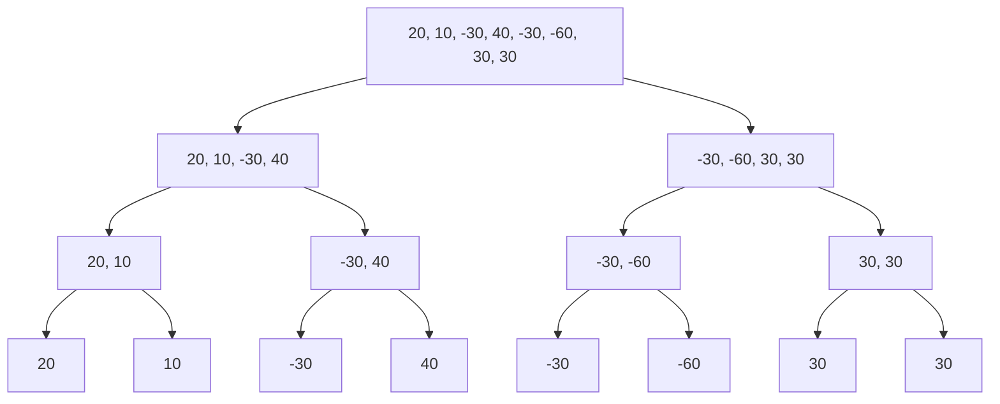

# 数据结构与算法分析基础

!!! abstract
	本篇属于比较完整的自学笔记, 里面有绝大部分数据结构基础与算法分析的知识, 当然还有一部分我的延伸思考. 由于博主之前有一点点数据结构和算法的基础, 并且主要的参考内容是一本老书*Data Structures and Algorithm Analysis in C, Second Edition*, 所以笔记相较于一般课程可能不会很完整. 部分内容也参考了教程: <https://pacman.cs.tsinghua.edu.cn/~hanwentao/dsa/>


## 附录 I 基础数学
---
### 附录 1. 1 等幂求和

$$
\left\{\begin{matrix}
\sum_{i=1}^{N}i^k &\approx \frac{N^{k+1}}{\left | k+1 \right | };\ k\ne -1 \\
\sum_{i=1}^{N}i^{-1} &\approx \ln{N};\ k=-1
\end{matrix}\right.
$$

- 证明 (**递归差分法**)

下面是 $k\ge0$ 时的情况. 观察这样一个式子: $P_n(x)=(x+1)^n-x^n(n\ne1)$. 以 $n=3$ 时为例: $P_3(x)=(x+1)^3-x^3=3x^2+3x+1$, 可以进行如下变形:

$$
\begin{align*}
Left\rightarrow\sum_{x=1}^{n}P_3(x)&=(n+1)^3-1\\
Right\rightarrow\sum_{x=1}^{n}P_3(x)&=3\sum_{x=1}^{n}x^2+3\sum_{x=1}^{n}x+n=3\sum_{x=1}^{n}x^2+\frac{3}{2}n^2+\frac{5}{2}n\\
\sum_{x=1}^{n}x^2&=\frac{1}{3}[(n+1)^3-1-\frac{3}{2}n^2-\frac{5}{2}n]
\\&=\frac{1}{3}n^3+\frac{1}{2}n^2+\frac{1}{6}n=\frac{1}{6}n(n+1)(2n+1)
\end{align*}
$$

用上面的方式我们便得到了平方求和的公式. 同理, 我们猜想当 $n > 3$ 时同样可用类似方法. 对任意 $n > 0$, 根据二项式定理展开得到:

$$
\begin{align*}
P_n(x) &= (x+1)^n-x^n=\begin{pmatrix}1 \\n \end{pmatrix}x^{n-1}+\begin{pmatrix}2 \\n \end{pmatrix}x^{n-2}+\cdots+\begin{pmatrix}n \\n \end{pmatrix}x^{0} \\
\sum_{x=1}^{N}P_n(x) &= \sum_{x=1}^{N}[(x+1)^n-x^n]=\begin{pmatrix}1 \\n \end{pmatrix}\sum_{x=1}^{N}x^{n-1}+\begin{pmatrix}2 \\n \end{pmatrix}\sum_{x=1}^{N}x^{n-2}+\cdots+N\\
(N+1)^n-1&=\begin{pmatrix}1 \\n \end{pmatrix}\sum_{x=1}^{N}x^{n-1}+\begin{pmatrix}2 \\n \end{pmatrix}\sum_{x=1}^{N}x^{n-2}+\cdots+N\\
\sum_{x=1}^{N}x^{n-1}&=\frac{1}{n}[(N+1)^n-1-\begin{pmatrix}2 \\n \end{pmatrix}\sum_{x=1}^{N}x^{n-2}-\cdots-N]
\end{align*}
$$

接下来, 我们在递归的前提下已经知道前 $n-2$ 次幂的所有求和公式. 据此即可推导出 $n-1$ 次幂的求和公式.

不难发现, 对于任意 $\sum_{x=1}^{N}x^{n-1}$, 其最高次项都是 $\frac{N^n}{n}$. 因此, 在 $N$ 足够大时, 有:

$$
\sum_{i=1}^{N}i^{k}\approx\frac{N^{n+1}}{n+1}
$$

上面只说明了 $k\ge0$ 时的情况. 对于 $k < 0$, 首先确定是否存在可精确表达的初等函数闭式形式. 我们考虑一个满足前述形式的函数 $F$, 使得 $F(N)-F(N-1)=\frac{1}{N^p}$. 若存在, 即可计算: $\sum_{N=2}^{n}(F(N)-F(N-1))=\sum_{N=2}^{n}\frac{1}{N^p}$

显然, 若 $F(x)$ 中存在无理项, 则必须在 $F(N)-F(N-1)$ 式中永久被恰好抵消, 否则不满足右式恒为有理数的前提. 据此, $F(x)$ 中的无理函数部分无关紧要, 我们只需要考虑 $F$ 中的有理函数部分.

首先, 由于右侧式子不存在多项式, 若左侧存在则必须恰好抵消, 所以同样我们只需要考虑 $F$ 为真分式表达式的情况. 对于任意真分式, 我们知道必定存在一个 $N$ 使得 $F(N)$ 的分母 $A(N_0)$ 为 $0$, 也就是未定义点. 对于 $F(N)-F(N-1)$, 则必然至少存在两个未定义点, 并且 $F(N-1)$ 的未定义点恰好在 $F(N)$ 未定义点的右侧, 两点在坐标系上距离为 $1$. 而对于 $\frac{1}{N^p}$, 显然只存在一个未定义点. 综上所述, 这样的初等函数闭式形式并不存在.

据此, 我们关注该式的估计形式. 利用积分判别法思想:

$$
\begin{align*}
&\ \ \ \ \ \ \ \ \ \ \ \int_{2}^{n}\frac{1}{N^p} \le\sum_{N=2}^{n}\frac{1}{N^p}\le\int_{2}^{n}\frac{1}{(N-1)^p}\\
&(p=1)\ \ln n-\ln 2\le\sum_{N=2}^{n}\frac{1}{N^p}\le\ln{(n-1)}\\
&(p\ne1)\ \frac{1}{p-1}(\frac{1}{2^{p-1}}-\frac{1}{n^{p-1}})\le\sum_{N=2}^{n}\frac{1}{N^p}\le\frac{1}{p-1}(1-\frac{1}{(n-1)^{p-1}})
\end{align*}
$$

因此, 在 $n$ 足够大时, 不论正负, 有:

$$
\left\{\begin{matrix}
\sum_{i=1}^{N}i^k &\approx \frac{N^{k+1}}{\left | k+1 \right | };\ k\ne -1 \\
\sum_{i=1}^{N}i^{-1} &\approx \ln{N};\ k=-1
\end{matrix}\right.
$$

### 附录 1. 2 复杂度计算基础

!!! note
	以下是常见的两个重要结论. 使用极限理论可以很容易证明, 并且符合直觉.

其一, 若 $T_1(N)=O(f(N))$ 且 $T_2(N)=O(g(N))$, 则:

- $T_1(N)+T_2(N)=\max(O(f(N)), O(g(N)))$
- $T_1(N)\times T_2(N)=O(f(N)\times g(N))$.

!!! note
	严格而言, $O()$ 运算符表达为一个函数族, 也就是满足该定义所有函数的集合, 因此不存在乘法运算. 然而, 算法分析中许多人滥用该符号, 因此有 $Big-O$ 约定: $O(f(N))\times O(g(N))=O(f(N)\times g(N))$.

其二, 对于任意常数 $k$, 有: $\log^kN=O(N)$.

### 附录 1. 3 算法复杂度分析法则

- `for` 循环:

```cpp
for (int i = 0; i < N; i ++)
	c += i;
```

复杂度就是循环次数 $O(N)$

-  嵌套的 `for` 循环:

```cpp
for (int i = 0; i < N; i ++)
	for (int j = 0; j < N; j ++)
		c += j * i;
```

复杂度就是循环次数乘以更深的循环次数 $O(N^2)$

- 顺序语句复杂度计算

```cpp
for (int i = 0; i < N; i ++)
	c += i;

for (int i = 0; i < N; i ++)
	for (int j = 0; j < N; j ++)
		c += j * i;
```

复杂度为 $\max (O(N) ,O(N^2))=O(N^2)$

- `if/else` 语句

```cpp
if (A1)
	B1
else
	B2
```

复杂度为 $\max (O(B1), O(B2))$

- 递归调用(可改写为循环结构类)

使用 `for` 循环复杂度计算方法即可.

- 递归调用(不可改写为循环结构类)


## 附录 II 算法设计原则
---

- **收敛性**: 所有调用结果最终必须可归于某些基准情形. 换言之, 最后一轮所有可能的函数调用返回值是确定的, 与函数传入的值无关.
- **单调性**: 任何一轮的调用方向都是唯一确定的. 准确的说, 是朝着那些基准情形的方向进行的.
- **完备性**: 任何设计算法中确定合法的输入值都有唯一确定的处理情况, 并且中途调用函数的返回值同样是合法的.
- **合成效益法则**: 求解某个问题的同一实例时不要二次计算, 浪费算力.

!!! tip
	**合成效益法则的解释**: 最为典型的反面例子就是斐波那契数计算. 假设我们使用普通的递归方法:
	
	```cpp
	#include <bits/stdc++.h>
	
	using namespace std;
	
	int fib(int x) {
		if (x <= 1)
			return x;
		else
			return fib(x - 1) + fib(x - 2);
	}
	
	int main(void) {
		print(fib(6));
	
		return 0;
	}
	```
	
	实际调用过程为
	
	```mermaid
	flowchart TD
	    n6["fib(6)"] --> n5["fib(5)"]
	    n6 --> n4["fib(4)"]

	    n5 --> n4_2["fib(4)"]
	    n5 --> n3["fib(3)"]
	
	    n4 --> n3_2["fib(3)"]
	    n4 --> n2["fib(2)"]
	
	    n4_2 --> n3_3["fib(3)"]
	    n4_2 --> n2_2["fib(2)"]
	
	    n3 --> n2_3["fib(2)"]
	    n3 --> n1["fib(1)"]
	
	    n3_2 --> n2_4["fib(2)"]
	    n3_2 --> n1_2["fib(1)"]
	
	    n3_3 --> n2_5["fib(2)"]
	    n3_3 --> n1_3["fib(1)"]
	
	    n2 --> n1_4["fib(1)"]
	    n2 --> n0["fib(0)"]
	
	    n2_2 --> n1_5["fib(1)"]
	    n2_2 --> n0_2["fib(0)"]
	
	    n2_3 --> n1_6["fib(1)"]
	    n2_3 --> n0_3["fib(0)"]
	
	    n2_4 --> n1_7["fib(1)"]
	    n2_4 --> n0_4["fib(0)"]
	
	    n2_5 --> n1_8["fib(1)"]
	    n2_5 --> n0_5["fib(0)"]
	```
	
	不难发现, 尽管 `fib(6)` 本来只需要计算从 $2$ 到 $6$ 五项的值, 并且每个值都可以通过上两项获取. 也就是说, 实际上只需要调用函数 $6$ 次就行了. 而上述算法的调用量相当可观, 进行了许多无意义的重复计算, 这在更庞大的数据量情况下是不可接受的. 这一思想的实现之一便是动态规划, 利用好已有的结果而不是再算一遍.

## 附录 III 算法分析实例
---

!!! note
	标注了参考内容出处. 注意, 这部分内容并不是严格按照书籍顺序和讲述内容进行的, 部分算法个人进行了优化调整, 部分实例拓展了其他几种算法.

### 附录 3. 1 最大子序列和[^1]

- 问题描述: 对于某一有限数列 $a_n=[a_1, a_2, a_3, \cdots]$, 我们取从第 $i$ 到第 $j$ 的项求和(包括 $a_i$ 和 $a_j$), 求该子数列和的最大值.

最简单的思路是完全穷举, 遍历所有选取方案. 原书图 2-5 算法 1 存在一个常见错误, 默认了总和最大值的结果不会小于 $0$. 但在部分 OJ 上这样写是不会通过的, 并且这样写也不够严格. 更通用的方式是改进原本的 `int maxSum = 0` 为 `int maxSum = s[0]`. 使用改进代码表述为

```cpp hl_lines="7"
int maxSubSeq(const vector<int> &s) {
	int length = s.size();
	if (length <= 0) {
		return 0;
	}

	int maxSum = s[0];
	for (int i = 0; i < length; i ++) {
		for (int j = i; j < length; j ++) {
			int thisSum = 0;
			for (int h = i; h <= j; h ++) {
				thisSum += s[h];
			}

			if (thisSum > maxSum) {
				maxSum = thisSum;
			}
		}
	}

	return maxSum;
}
```

我们设数列长度为 $n$, 则精确复杂度显然为 

$$
\begin{align*}
S&=\sum_{i=1}^{n}(1+2+3+\cdots +(n-(i-1)))\\
&=\frac{1}{2}\sum_{i=1}^{n}(i-(n+1))(i-(n+2))\\
&=\frac{1}{2}\sum_{i=1}^{n}(i^2-(2n+3)i+(n+1)(n+2))\\
&=\frac{1}{2}(\frac{1}{6}n(n+1)(2n+1)-\frac{1}{2}(2n+3)n(n+1)+n(n+1)(n+2))\\
&=\frac{1}{6}n(n+1)(n+2)=\frac{1}{6}n^3+\frac{1}{2}n^2+\frac{1}{3}n
\end{align*}
$$

当然, 我们可以直接简单设最坏情况作为复杂度. 也就是三层嵌套循环, 时间复杂度为 $O(N^3)$

这一时间复杂度显然可以进一步减小. 最显然的一点是, 在保留前一层 `for` 循环计算方式的前提下, 观察后两轮, 第三轮 `for` 循环完全没有必要. 假设已确定 $a_i$ 的位置, 而后从第 $i$ 开始向后计数到最后一项, 则从第 $i$ 项到第 $j$ 项的区间和可以加入到第 $i$ 项到第 $j+1$ 项的区间和. 换言之, 通过 $S_{[i, j+1]}=S_{[i, j]}+a_{j+1}$ 利用好上次计算的结果即可, 不需要重复计算. 使用代码表述为

```cpp
int maxSubSeq(const vector<int> &lst) {
    int length = lst.size();

    if (length <= 0) {
        return 0;
    }

    int maxSum = lst[0];
    for (int i = 0; i < length; i ++) {
        int nowSum = 0;
        for (int j = i; j < length; j ++) {
            nowSum += lst[j];

            if (nowSum > maxSum)
                maxSum = nowSum;
        }
    }

    return maxSum;
}
```

这一简单的优化思路将原本 $O(N^3)$ 的时间复杂度减少到了 $O(N^2)$. 但是, 这样是最完美的方式吗?

显然不是. 优化这一算法最简单的思路仍然是, 检查是否出现了重复计算的情况. 为了方便表述, 我们首先将上面的算法代码进行等价替换

```cpp
int maxSubSeq(const vector<int> &lst) {
    int length = lst.size();

    if (length <= 0) {
        return 0;
    }

    int maxSum = lst[0];
    for (int i = 0; i < length; i ++) {
        int nowSum = 0;
        for (int j = 0; j <= i; j ++) {
            nowSum += lst[j];

            if (nowSum > maxSum)
                maxSum = nowSum;
        }
    }

    return maxSum;
}
```

现在暂时抛开算法的具体实现, 我们考虑, 假设目前已经确定了 $[1,m-1]$ 上的最大子数列之和, 那么 $[1, m]$ 的最大子数列之和 $S_{[1, m]}$ 有且仅有两种情况

- 包括了第 $m$ 项, 也就是必须包括第 $m$ 项的 $[1, m]$ 上的最大子数列之和 $S_m$. 这一 $S_m$ 要么就是只包括 $a_m$ 本身, 要么就是 $a_m$ 加上前面从 $[1,m-1]$ 的包括 $a_{m-1}$ 最大子序列之和, 即 $a_m+S_{m-1}$. 这一点取决于二者之间大小关系.
- 不包括第 $m$ 项, 也就是已有的 $[1,m-1]$ 上的最大子数列之和 $S_{[1, m-1]}$.

这一完备的包含所有情况的事实将持续到整个数列完成遍历. 因此, 该处理方式具有可行性. 下面再确定二者的递推式. 根据上面的分析, 对于前者, 显然有 $S_m=\max(0, S_{m-1})+a_m$; 对于后者, 也显然有 $S_{[1, m-1]}=\max(S_m, S_{[1, m-1]})$.

这就是大名鼎鼎的 [卡丹算法](https://zh.wikipedia.org/wiki/%E6%9C%80%E5%A4%A7%E5%AD%90%E6%95%B0%E5%88%97%E9%97%AE%E9%A2%98). 我们用程序实现为

```cpp
int maxSubSeq(const vector<int> &lst) {
    int length = lst.size();

    if (length <= 0) {
        return -1;
    }

    int maxSeqSum = lst[0], endSeqSum = lst[0];

    for (int i = 1; i < length; i ++) {
        endSeqSum = max(0, endSeqSum) + lst[i];
        maxSeqSum = max(endSeqSum, maxSeqSum);
    }

    return maxSeqSum;
}
```

显然, 我们成功的将算法复杂度改善到了 $O(N)$. 上面这一线性时间复杂度的算法基本就是最优算法了. 但这显然不是最为通用的一种方法. 或者说, 这算是本问题的一个特解. 有没有什么更加一般的方式呢?

答案是当然. 虽然接下来讲解的方法时间复杂度不如上面的优秀, 但代表了一种普遍的算法思想. 这便是, **分治法**. 所谓分治, 即分而治之. 下面以最简单的二分法为例解决.

首先确定一般递归情况, 设数列 $a_{[1, n]}$, 我们以 $\left \lfloor \frac{n}{2} \right \rfloor$ 为界分为 $a_{[1, \left \lfloor \frac{n}{2} \right \rfloor]}$ 和 $a_{[\left \lfloor \frac{n}{2} \right \rfloor + 1, n]}$ 两部分, 则最子数列之和要么在 $a_{[1, \left \lfloor \frac{n}{2} \right \rfloor]}$, 要么在 $a_{[\left \lfloor \frac{n}{2} \right \rfloor + 1, n]}$, 要么在 $\left \lfloor \frac{n}{2} \right \rfloor$ 两边(跨过 $a_{[1, \left \lfloor \frac{n}{2} \right \rfloor]}$ 和 $a_{[\left \lfloor \frac{n}{2} \right \rfloor + 1, n]}$ 这两数列). 以此不断递归, 直到遇到 $\left \lfloor \frac{n}{2} \right \rfloor=0$ 的情况, 也就 $n=1$ 的情况(默认不为空数列). 为了方便说明, 我们以具体数列为例. 假设 $a_n=[20, 10, -30, 40, -30, -60, 30, 30]$, 则其可不断二分为:



我们设最高层为 $4$, 最底层为 $1$, 因此首先对 $1$ 层处理. 显然 $1$ 层各自的最大子序列和就是其本身. 接下来看 $2$ 层, 如果视作二元组 $(20, 10)$, 则值只可能为 $20$, $10$, 以及跨过二者的值. 唯一跨过的方式就是同时选择 $20$, $10$ 两项. 确定之后进一步向上到 $3$ 层, 则变为四元组 $(20, 10, -30, 40)$, 因此有且仅有两边最大值之一或者跨过中间项的值. 也就是说, 必须保证存在 $10$, $-30$, 再加上需要保证连续性, 因此只需要进行一次简单的两侧遍历: 首先对于左侧子数列, 必须包括 $10$, 以 $10$ 为基础向左遍历, 确定左侧过边界点最大值; 接下来对于右侧子数列, 必须包括 $-30$, 以 $-30$ 为基础向右遍历, 确定右侧过边界点最大值. 换言之, 过中间点的最大子数列和的值就是左侧过中间左边界点的最大子数列之和加上右侧过中间右边界点的最大子数列之和的和. 因为从边界点出发, 单轮每一层时间复杂度有且仅有 $O(N)$. 而我们总共需要计算 $\log N$ 次. 进一步推广, 考虑其他(奇数长度)情况, 使用二分展开到最后最终得到的最下面单个分支深度只可能减少, 也就是说将 $\log N$ 向上估计即可, 时间复杂度总计仍然为 $O(N\log N$).

利用上面的思路即可完成分治法版本的最大子序列和算法

```cpp
int maxSubSeq(const vector<int> &lst, const int &beg, const int &end) {
    /* 全部为闭区间, 包括 beg 和 end */
    /* 结束条件 */
    if (end == beg) {
        return lst[beg];
    }

    int beg_max = maxSubSeq(lst, beg, (beg + end)/2);
    int end_max = maxSubSeq(lst, (beg + end)/2 + 1, end);

    int lef_max = lst[(beg + end)/2], lef_sum = 0;
    for (int i = (beg + end)/2; i >= beg; i --) {
        lef_sum += lst[i];
        if (lef_sum > lef_max) {
            lef_max = lef_sum;
        }
    }

    int rig_max = lst[(beg + end)/2 + 1], rig_sum = 0;
    for (int i = (beg + end)/2 + 1; i <= end; i ++) {
        rig_sum += lst[i];
        if (rig_sum > rig_max) {
            rig_max = rig_sum;
        }
    }

    return max(lef_max + rig_max, max(beg_max, end_max));
}

int solve(const vector<int> &lst) { return maxSubSeq(lst, 0, lst.size() - 1); }
```


[^1]:
	*Data Structures and Algorithm Analysis in C, Second Edition 2. 4. 3* P23